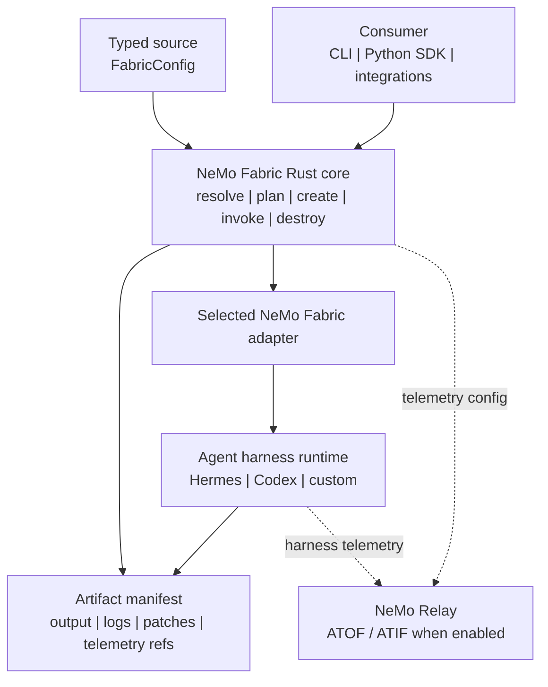

<!--
SPDX-FileCopyrightText: Copyright (c) 2026, NVIDIA CORPORATION & AFFILIATES. All rights reserved.
SPDX-License-Identifier: Apache-2.0
-->

[](https://github.com/NVIDIA/NeMo-Fabric/blob/main/LICENSE)
[](https://github.com/NVIDIA/NeMo-Fabric/)
[](https://github.com/NVIDIA/NeMo-Fabric/releases)
[](https://pypi.org/project/nemo-fabric/)
[](https://crates.io/crates/nemo-fabric-core)
[](https://crates.io/crates/nemo-fabric-cli)

# NVIDIA NeMo Fabric

<p align="center">
  
</p>

NeMo Fabric is a runtime execution layer that connects deployment platforms, evaluation harnesses, and RL rollout harnesses to multiple agent runtimes through one configurable, observable lifecycle surface.

You choose an agent harness-Hermes Agent, Codex, Claude Code, LangChain Deep Agents, or another harness integrated through a custom adapter-and call NeMo Fabric from your application or an evaluation harness such as Harbor; NeMo Fabric resolves the adapter, manages the harness lifecycle, and returns normalized results and artifacts.

## Architecture

NeMo Fabric standardizes how applications configure, launch, invoke, and collect
artifacts from agent harnesses.

NeMo Fabric provides:

- a versioned, typed `FabricConfig` contract constructed through the SDK;
- ordinary Python composition for harness and experiment variants;
- adapter descriptors for harness-specific launch and control;
- a Rust core, Python SDK, and standalone experimentation CLI;
- JSON Schema snapshots for the public config and runtime contract;
- normalized run results, artifact manifests, and telemetry references.



## Quick Start: Experimentation CLI

The `nemo-fabric` CLI is a maintained, experimental developer interface for
quick harness experiments, smoke tests, examples, planning, and diagnostics.
Its command contract can evolve as experiments mature. The Python SDK remains
the stable application-facing contract.

Install the Rust CLI from this source checkout, verify it, and run the
credential-free preset:

```bash
cargo install --path crates/fabric-cli --locked
nemo-fabric --version
nemo-fabric preset show scripted
nemo-fabric run --preset scripted --input "fabric works"
```

Copy an editable Python starting point with:

```bash
nemo-fabric example init code-review ./my-agent --language python
```

See the [experimentation CLI guide](docs/experimentation/cli.mdx) for the CLI's
intent and boundaries.

## Quick Start: Hermes Agent

This path installs NeMo Fabric, installs Hermes Agent in a separate Python environment,
and runs one input through the Hermes Agent adapter.

Prerequisites:

- Rust and Cargo
- Python 3.11+ for NeMo Fabric
- Python 3.11-3.13 for Hermes Agent
- [uv](https://docs.astral.sh/uv/getting-started/installation/)
- `just` 1.50.0+
- `NVIDIA_API_KEY` for NVIDIA-hosted model access

Install `just` if not already installed.
```bash
cargo install just --locked
```

Ensure the local Cargo bin directory is in your `PATH`, if not set it with:

```bash
export PATH="$HOME/.cargo/bin:$PATH"
```

Refer to the [official installation guide](https://just.systems/man/en/installation.html) for more details.

Install NeMo Fabric from the source checkout:

```bash
just build-all
just wheels
```

Install NeMo Fabric, Hermes Agent, and the Hermes Agent adapter into an environment:

```bash
# Use any Python 3.11-3.13 interpreter for Hermes Agent.
python3 -m venv .tmp/hermes-venv
.tmp/hermes-venv/bin/python -m pip install --find-links dist "nemo-fabric[hermes]"
```

If you are working from a local Hermes Agent checkout, replace the final install line
with:

```bash
.tmp/hermes-venv/bin/python -m pip install -e ../hermes-agent
.tmp/hermes-venv/bin/python -m pip install --find-links <path-fabric-repo>/dist nemo-fabric-adapters-hermes
```

Run the code-review example:

```bash
export NVIDIA_API_KEY=...
export ADAPTER_PYTHON="$PWD/.tmp/hermes-venv/bin/python"

.venv/bin/python -m examples.code_review_agent \
  --input "Reply with exactly: fabric works"
```

`ADAPTER_PYTHON` selects the interpreter used to launch any Python adapter.
An explicit `harness.settings.python` or `harness.settings.python_env` takes
precedence. If none is configured and `ADAPTER_PYTHON` is unset, NeMo Fabric falls
back to `python3`. 

Use `ADAPTER_PYTHON` when the harness is installed in a separate environment from NeMo Fabric. The environment must have the adapter package installed. The adapters Python packages are designedto be small with minimal dependencies.

The run returns a normalized `RunResult` JSON payload and writes logs/artifacts
under `examples/code_review_agent/artifacts/hermes/`. Its complete base
config and clone-based variants live in
`examples/code_review_agent/config.py`.

### Next Steps

- Follow the [Example Notebooks](examples/notebooks/README.md) for a guided tour of the Python SDK.
- Refer to the [Python SDK guide](docs/sdk/python.mdx): typed configuration, planning,
  diagnostics, requests, multi-turn runtimes, parallelism, results, and errors.

## Claude Adapter

Build the local wheels and install NeMo Fabric with the independent Claude adapter:

```bash
just wheels
python -m pip install --find-links dist "nemo-fabric[claude]"
```

Refer to the [Claude adapter guide](adapters/claude/README.md) for
typed configuration, normalized tools, MCP and skills, multi-turn resume,
authentication, and execution details.

## Core Concepts

- **Typed config:** callers construct a complete `FabricConfig` in Python.
  Start with the [Python SDK guide](docs/sdk/python.mdx), and refer to
  [`examples/code_review_agent/config.py`](examples/code_review_agent/config.py)
  for a complete application example.
- **Variants:** ordinary Python functions copy and modify complete configs to
  vary the harness, model, MCP, tools, skills, telemetry, or environment.
- **Experimentation CLI:** presets provide quick probes, examples provide
  maintained runnable workflows, and `example init` generates editable Python
  or Rust applications that call a language API directly.
- **Tools policy:** use top-level `tools.blocked` for harness-neutral blocked
  tool policy. Names are interpreted by the selected adapter:

  ```python
  config.block_tools("browser", "shell")
  ```

  The selected adapter interprets these names: Hermes Agent maps them to disabled
  toolsets, Claude maps them to `disallowed_tools`, Deep Agents enforces them
  with middleware, and adapters without a native deny mechanism route the
  policy as unsupported.
- **Adapters:** harness-specific integrations selected by `harness.adapter_id`.
  The Hermes Agent adapter lives under `adapters/hermes/`; the Codex adapter lives under `adapters/codex/`; the
  [Claude adapter](adapters/claude/README.md)
  lives under `adapters/claude/`; the LangChain Deep Agents adapter lives under
  `adapters/deepagents/`. Harness Agent-specific extensions belong under
  `harness.settings` so the normalized contract can remain stable.
- **Artifacts:** normalized output, logs, patches, and telemetry references
  returned through an `ArtifactManifest`.

NeMo Fabric accepts complete typed configs. Compose variants in Python before
calling the SDK. Refer to the [Python SDK guide](docs/sdk/python.mdx) for the
complete public API, type definitions, lifecycle semantics, and error behavior.

`run(...)` owns the complete start, invoke, and stop lifecycle. For typed
in-memory configuration, planning and diagnostics, explicit requests,
multi-turn runtimes, application-owned parallelism, results, and errors, see
the [Python SDK guide](docs/sdk/python.mdx). Exact signatures are in the
[generated Python API reference](docs/reference/api/python-library-reference/index.md).

## More Workflows

- [Example Notebooks](examples/notebooks/README.md) provide a guided tour of the Python SDK.
- [Python SDK guide](docs/sdk/python.mdx): typed configuration, planning,
  diagnostics, requests, multi-turn runtimes, parallelism, results, and errors.
- [Experimentation CLI](docs/experimentation/cli.mdx): presets, maintained
  examples, editable application scaffolds, and explicit non-goals.
- [Consumer integration skills](skills/README.md): repository-local coding-agent
  skills for integrating NeMo Fabric into an application through the Python SDK.
- [Getting Started overview](docs/about-nemo-fabric/overview.mdx): interface
  selection and the end-to-end NeMo Fabric workflow.
- [Harbor examples](examples/harbor/README.md): validate the integration with a
  deterministic, credential-free calculator smoke, optionally run the same
  task with Hermes Agent or Claude, and evaluate real coding tasks with SWE-Bench.
- Adapter guides: [Hermes Agent](adapters/hermes/README.md),
  [Codex](adapters/codex/README.md), and
  [Deep Agents](adapters/deepagents/README.md).

## Tests

To run the full test suite, bootstrap a virtual environment with the optional dependencies.

```bash
uv venv --seed .venv --python 3.12
source .venv/bin/activate
uv sync --all-groups --all-extras
```

Build NeMo Fabric and the Python extension. Because the virtual environment is
already bootstrapped, pass `no_uv=true` to avoid reinstalling dependencies.

```bash
just no_uv=true build-all
```

Run both Rust and Python tests:

```bash
just no_uv=true test-all
```

Run just the Rust tests:

```bash
just no_uv=true test-rust
```

Run just the Python tests:

```bash
just no_uv=true test-python
```

Running `pytest` directly:

```bash
pytest
```
